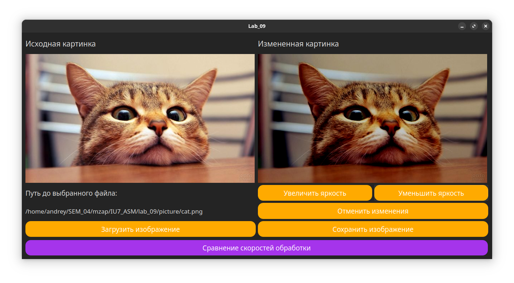

# Лабораторная работа №9

Реализовать в виде ассемблерной вставки с использованием расширений
процессора x86-64 AVX или <u>SSE</u> на выбор:
1. Умножение матриц LxM * MxN (исходные данные вводятся с
клавиатуры).
2. <u>Изменение яркости растрового изображения.</u>
 
## Реализация

