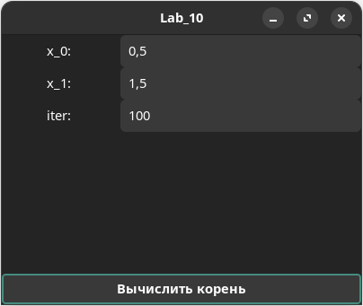

# Лабораторная работа №10

Требуется создать программу с GUI, выполняющую задание из л/р 8 (поиск корня
уравнения по варианту). Начальные данные должны задаваться в полях ввода,
результат выводиться в поле/надписи/диалоге.
Выполнять задание можно под Windows (с использованием masm32), под Linux с
использованием GTK или других компиляторов и библиотек.

## Важное!!!
Через при запуске через терминал VSCode может выдавать ошибку:  

./app.exe: symbol lookup error: /snap/core20/current/lib/x86_64-linux-gnu/libpthread.so.0: undefined symbol: __libc_pthread_init, version GLIBC_PRIVATE

Подробнее об этой ошибке можно почитать здесь https://github.com/ros2/ros2/issues/1406

Для запуска нужно использовать скрипт <u>go.sh</u>, вызванный из обычного терминала.
 
## Реализация

