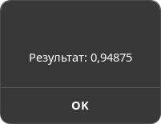

# Лабораторная работа №10

Требуется создать программу с GUI, выполняющую задание из л/р 8 (поиск корня
уравнения по варианту). Начальные данные должны задаваться в полях ввода,
результат выводиться в поле/надписи/диалоге.
Выполнять задание можно под Windows (с использованием masm32), под Linux с
использованием GTK или других компиляторов и библиотек.
 
## Реализация

